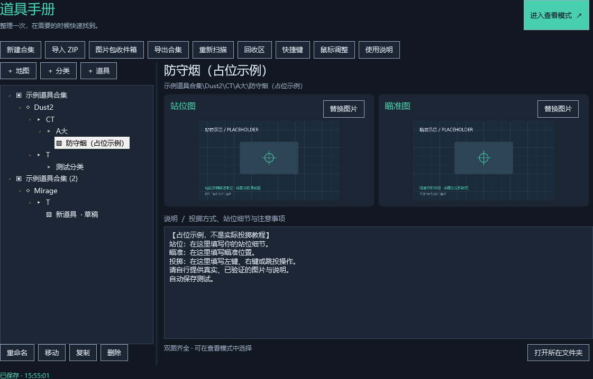
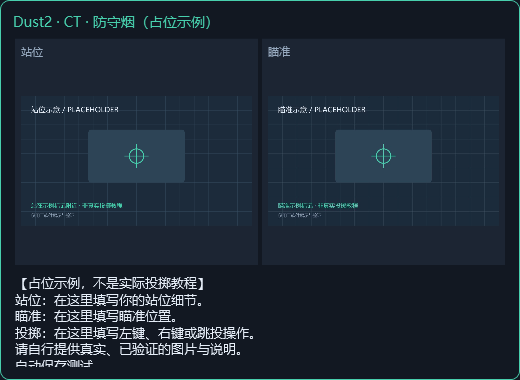
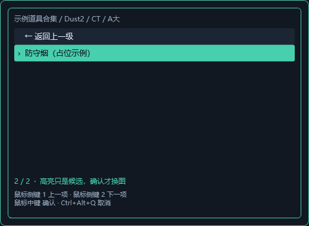
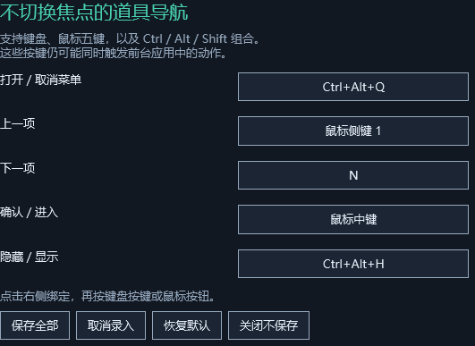

# 道具手册

道具手册是一款独立的 Windows 图片资料管理与悬浮查看软件。它把一套道具资料整理成“地图 / CT 或 T / 自定义分类 / 道具”，在需要时显示站位图、瞄准图和说明文字，方便临场查看和练习投掷。

它只是资料查看器。软件不读取游戏进程、窗口、内存、配置、日志或网络，不注入 DLL，不模拟输入，也不控制游戏。



## 适合做什么

- 整理自己的道具图片和文字说明。
- 导入、编辑、导出 ZIP 资料包。
- 用一个小型置顶面板查看站位图、瞄准图和说明。
- 在不释放鼠标控制的情况下，用后台快捷键浏览资料。

## 快速开始

1. 从 [Releases](https://github.com/EIA2024/cs2-grenade-handbook/releases/latest) 下载 Windows x64 便携包。
2. 双击 `道具手册.exe`。
3. 点击 `图片包收件箱`，导入 `示例道具合集.zip` 或自己的资料包。
4. 在左侧目录树选择地图、阵营、分类或具体道具。
5. 点击 `进入查看模式`。

查看模式会显示双图和说明；面板默认鼠标穿透，不主动抢焦点。



## 后台快捷浏览

进入查看模式后，可以用后台快捷键选择资料。默认绑定：

| 按键 | 动作 |
| --- | --- |
| `Ctrl+Alt+Q` | 打开 / 取消快捷菜单 |
| 鼠标侧键 1 | 上一项 |
| 鼠标侧键 2 | 下一项 |
| 鼠标中键 | 确认 / 进入 |
| `Ctrl+Alt+H` | 隐藏 / 显示图片 |

打开菜单后，上一项和下一项循环移动高亮，确认进入分类或选中道具。确认道具后才会更新图片；取消菜单会保留原来的图片。



五个动作都可以在 `快捷键` 窗口里重新绑定。支持单个键盘按键、鼠标左/右/中/侧键，以及 `Ctrl`、`Alt`、`Shift` 修饰组合。



## 资料包格式

ZIP 内推荐结构：

```text
EIA道具合集.zip
└─ EIA道具合集/
   └─ Dust2/
      ├─ CT/
      │  └─ A大/
      │     └─ A大防守烟/
      │        ├─ 站位.png
      │        ├─ 瞄准.jpg
      │        └─ 说明.txt
      └─ T/
```

固定层级是 `合集 / 英文地图 / CT 或 T`。CT/T 下面可以自由创建分类和道具目录。图片文件名用 `站位` 和 `瞄准`，说明文件用 UTF-8 的 `说明.txt`。

更完整的格式说明见 [docs/02-资料格式.md](docs/02-资料格式.md)。

## 常用操作

- `新建合集`：从空资料库开始整理。
- `导入 ZIP`：导入别人分享的资料包。
- `导出合集`：把当前合集重新打包分享或备份。
- `鼠标调整`：移动面板、缩放面板、切换横排/竖排、调整透明度。
- 托盘菜单：返回编辑器、隐藏/显示、恢复面板位置和退出。

完整使用说明见 [docs/01-使用说明.md](docs/01-使用说明.md)。

## 边界说明

道具手册是普通桌面软件，不保证覆盖独占全屏。实际可见性取决于系统、显示模式和前台程序。软件没有 Valve/VAC 官方认证，也不会把运行成功描述成反作弊认证。

项目坚持这些边界：

- 不查询或控制任何游戏进程、窗口、文件或内存。
- 不使用游戏渲染钩子、全局输入钩子、驱动或输入模拟。
- 后台快捷浏览只接收 Windows Raw Input 中已绑定的键盘/鼠标按钮事件。
- 返回编辑器、进入鼠标调整或退出软件时注销后台输入。

安全边界和验证记录见 [docs/05-安全审查与修复.md](docs/05-安全审查与修复.md) 和 [docs/04-本次验收记录.md](docs/04-本次验收记录.md)。

## 从源码构建

需要 Windows 和 .NET 10 SDK。仓库内优先使用 `.tools/dotnet`，否则使用系统 `dotnet`。

```powershell
pwsh -File .\构建.ps1
pwsh -File .\验证.ps1
pwsh -File .\构建.ps1 -Publish
pwsh -File .\验证.ps1 -Published
pwsh -File .\打包.ps1
```

开发入口见 [docs/06-开发者架构.md](docs/06-开发者架构.md)。
